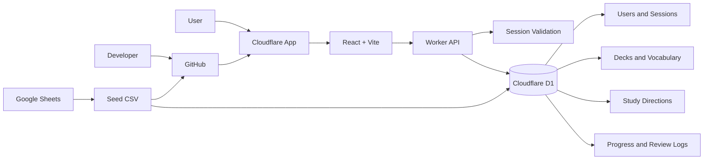

# 02. System architecture



## GitHub lưu

- Mã nguồn.
- Migration SQL.
- Seed CSV.
- Tài liệu thiết kế.

## D1 lưu

- Users và sessions.
- Decks và trạng thái deck theo user.
- Vocabulary.
- Study directions.
- Progress riêng cho từng study direction.
- Review logs.
- Settings theo ngôn ngữ.

## Cấu trúc source đề xuất

```text
src/
├── app/
├── modules/
│   ├── language-hub/
│   ├── english/
│   └── japanese/
└── shared/

worker/
├── routes/
├── services/
│   ├── auth/
│   ├── scheduler/
│   ├── planner/
│   └── import/
└── index.ts
```
