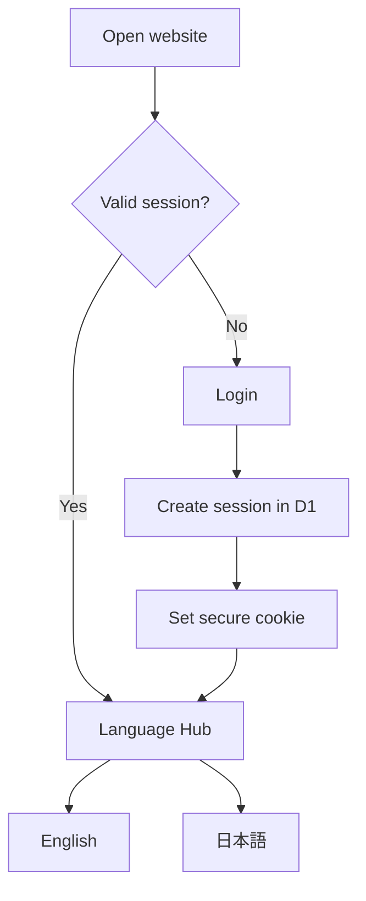

# 03. Authentication and Language Hub



Cookie đề xuất:

```http
Set-Cookie: __Host-session=<random-token>; Path=/; Max-Age=2592000; Secure; HttpOnly; SameSite=Lax
```

- Mỗi thiết bị có session riêng.
- Dữ liệu vẫn đồng bộ vì nằm trong D1.
- Sau login luôn hiện Language Hub.
- Chọn English thì chỉ dùng queue English.
- Chọn Japanese thì chỉ dùng queue Japanese.
