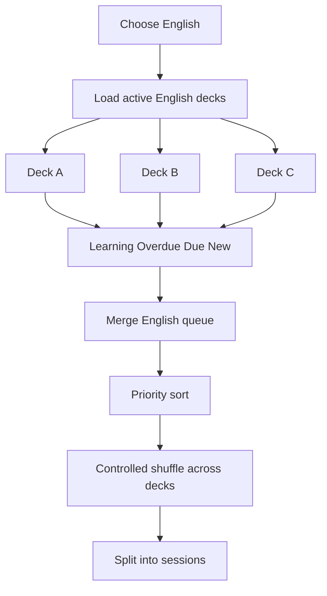

# 04. Deck selection and visibility

## Trạng thái deck theo user

- `active`: xuất hiện và tham gia queue.
- `hidden`: ẩn khỏi dashboard học và không tham gia queue.
- `archived`: cất khỏi thư viện chính, dữ liệu vẫn còn.
- Delete: xóa thật, là hành động riêng có cảnh báo.

Ẩn deck không xóa vocabulary, progress hoặc history.

## Chọn deck

Ví dụ English:

```text
[x] Daily English
[x] Electrical Engineering English
[ ] Workplace English
```

Planner chỉ lấy thẻ từ hai deck đang active/được chọn.

## Chọn nhiều deck



## Quy tắc trộn

- Không trộn English với Japanese.
- Chỉ trộn các deck đã chọn trong ngôn ngữ hiện tại.
- Learning và overdue vẫn ưu tiên trước.
- Trong cùng priority group, xen kẽ các deck nếu có thể.
- Tránh hai thẻ cùng deck đứng liền nhau nếu còn lựa chọn khác.
- Tránh các study direction của cùng vocabulary đứng quá gần nhau.

## Từ mới giữa nhiều deck

MVP chia đều daily new limit giữa active decks, rồi phân phối phần dư cho deck còn thẻ mới.

Ví dụ 6 từ mới, 3 deck:

```text
Deck A: 2
Deck B: 2
Deck C: 2
```

Sau này có thể dùng `new_card_weight` để ưu tiên deck.

## Bật lại deck bị ẩn

Nếu có backlog lớn, hiển thị lựa chọn:

- Tiếp tục lịch cũ.
- Phân bổ backlog dần trong một số ngày.
- Đặt lại thành new, chỉ khi người dùng chủ động chọn.

Không âm thầm sửa due date.
