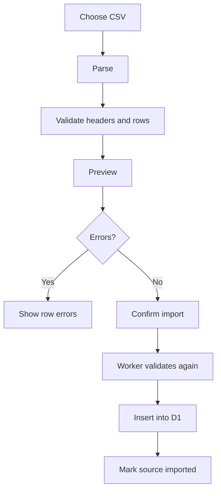

# 05. Vocabulary management

## Ba cách thêm

1. Quick Add
2. Detailed Add
3. CSV Import

## English fields

- word/phrase
- pronunciation
- meaning_vi
- definition_en
- example
- example_translation
- tags
- deck
- notes

## Japanese fields

- word/Kanji
- reading/Kana
- romaji
- meaning_vi
- meaning_en
- example
- example_translation
- JLPT level
- part_of_speech
- tags
- deck

## Import flow

## Lưu ở đâu

- Seed CSV: GitHub và D1 sau khi seed.
- CSV cá nhân: parse rồi ghi từng record vào D1; file upload không cần giữ lại.
- Add trên website: ghi thẳng vào D1.
- Progress: D1.

## Duplicate

Dùng `deck_id + normalized_word` để phát hiện vocabulary trùng.

## Một từ, nhiều chiều học

Ví dụ `電気`:

- 電気 -> điện
- 電気 -> でんき
- でんき -> 電気
- điện -> 電気

Mỗi direction có progress và due date riêng.
