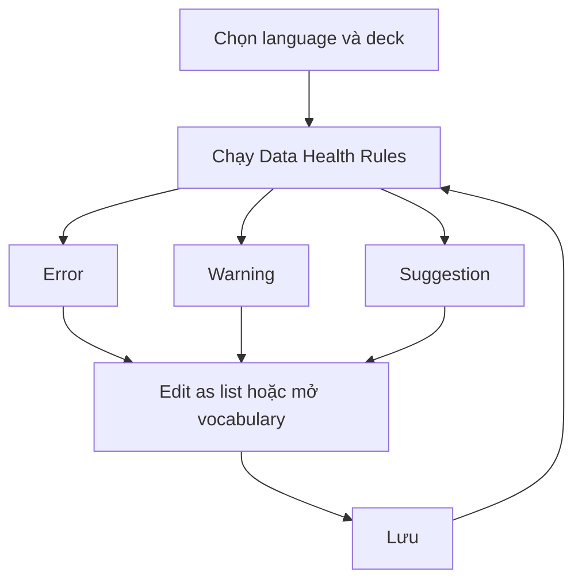

# 12. Data Health

Data Health chạy riêng cho English hoặc Japanese và có thể lọc theo deck.

## Mức độ
- Error: dữ liệu không đủ để tạo/thực hiện thẻ.
- Warning: vẫn học được nhưng chất lượng thấp.
- Suggestion: gợi ý bổ sung.

## Rules English
- Thiếu word hoặc meaning_vi.
- Thiếu pronunciation, example hoặc study direction.
- Trùng `deck_id + normalized_word`.
- Reverse direction thiếu dữ liệu đáp án.

## Rules Japanese
- Thiếu word, reading hoặc meaning_vi.
- `reading_to_kanji` nhưng từ không có Kanji.
- Trùng trong cùng deck.
- Reverse direction thiếu dữ liệu.

## Workflow

Nên có: Edit as list, export affected rows, ignore suggestion, rerun check.
