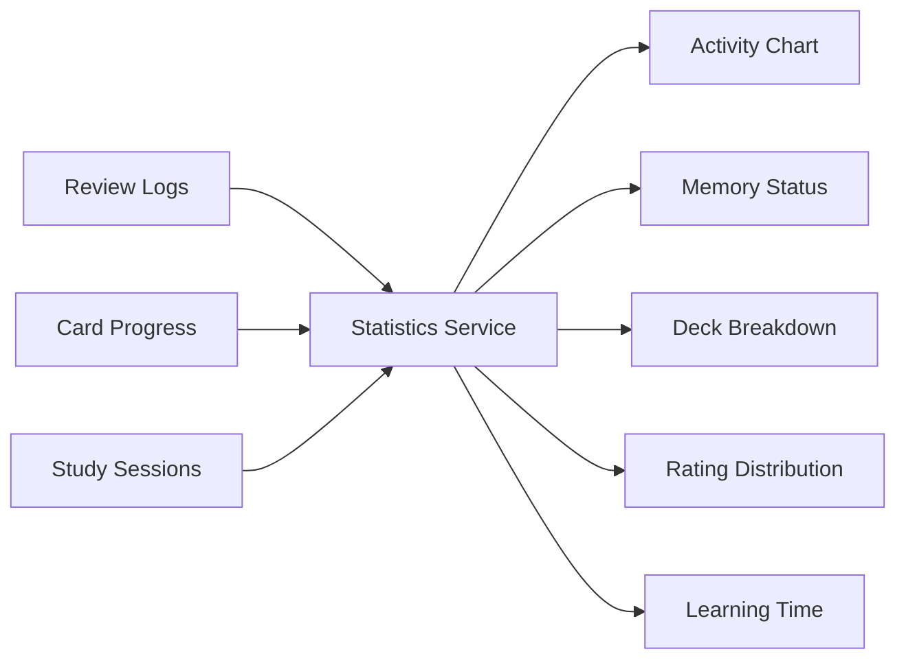

# 13. Visual Statistics

Statistics tách riêng theo language và có filter theo một hoặc nhiều deck.

## Đồ thị nên có
- Area/line chart: lượt review, vocabulary mới và phút học theo ngày.
- Donut chart: New, Learning, Review, Mastered, Needs attention.
- Bar chart: phân bố Again, Hard, Good, Easy.
- Stacked bar: trạng thái theo deck.
- Line chart: vocabulary đã gặp và vocabulary ổn định theo thời gian.

## Nguyên tắc UX
- Không xếp hạng.
- Không dùng cảnh báo mang tính trách móc.
- Chuỗi ngày chỉ là thông tin phụ.
- Tập trung vào xu hướng và khối lượng thực tế.

## Data flow

Thư viện đề xuất: Recharts.
