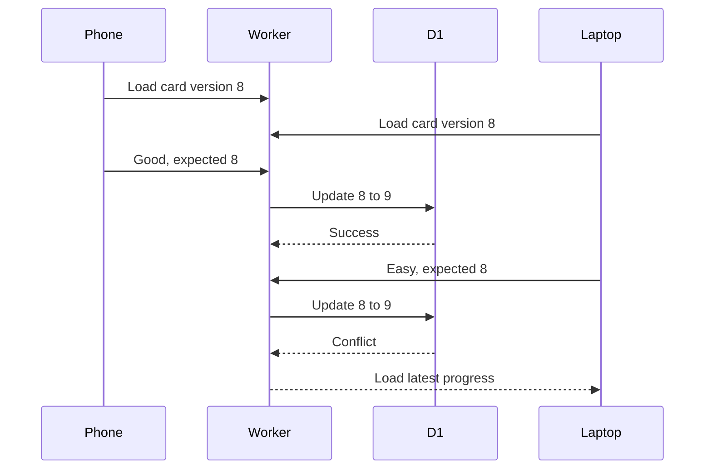

# 14. Persistent Sessions and Multi-device Sync

## Lưu phiên
- Khi bắt đầu học, tạo `study_sessions` và `study_session_cards`.
- Mỗi câu trả lời lưu ngay vào D1.
- Đóng trình duyệt giữa chừng vẫn có thể Continue.
- Session states: active, completed, abandoned, expired.

## Đồng bộ hai thiết bị
Mỗi progress có `version` và `updated_at`.

Client gửi `expectedProgressVersion`. Worker chỉ cập nhật nếu version chưa đổi. Nếu thiết bị khác đã trả lời, API trả conflict và client tải progress mới.

Mặc định, nếu đã có active session cùng language, đề nghị Continue existing session.
