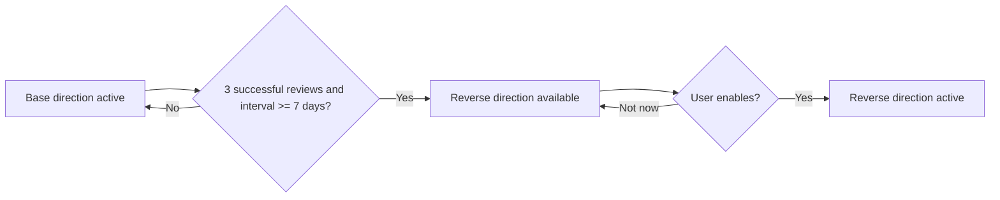

# 15. Progressive Study Directions

Không bật toàn bộ chiều học ngay lập tức.

## English
- Active đầu tiên: English -> Vietnamese.
- Có thể mở dần: Vietnamese -> English, Spelling, Fill in the blank.

## Japanese
- Active đầu tiên: Japanese -> Vietnamese, Japanese -> Reading.
- Có thể mở dần: Vietnamese -> Japanese, Reading -> Kanji.

## Direction states
- locked
- available
- active
- suspended

## Unlock suggestion
Direction prerequisite đạt:
- ít nhất 3 successful reviews,
- rating Good/Easy,
- interval ít nhất 7 ngày,
- không suspended hoặc leech.

Khi đạt điều kiện, chuyển sang `available` và hỏi người dùng trước khi kích hoạt. Không tự bật âm thầm.

