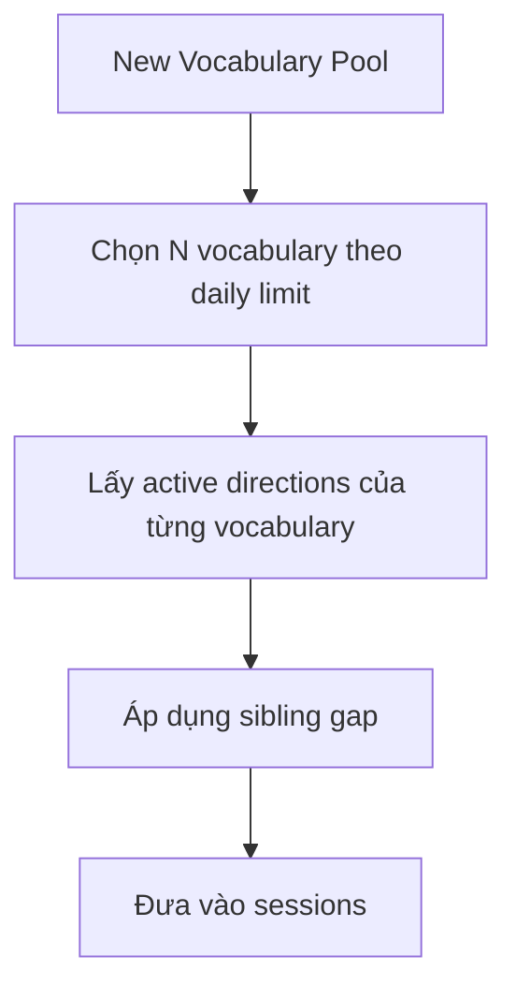

# 16. New Limit by Vocabulary

Daily new limit tính theo vocabulary gốc, không theo số study cards.

Ví dụ:
- 5 Japanese vocabulary mới.
- Mỗi vocabulary có 2 active directions.
- Kết quả có thể là 10 new cards nhưng vẫn chỉ tính là 5 vocabulary mới.

## Planner flow

Nếu không đủ khoảng cách giữa sibling cards, direction thứ hai được đẩy về cuối phiên hoặc phiên sau.
