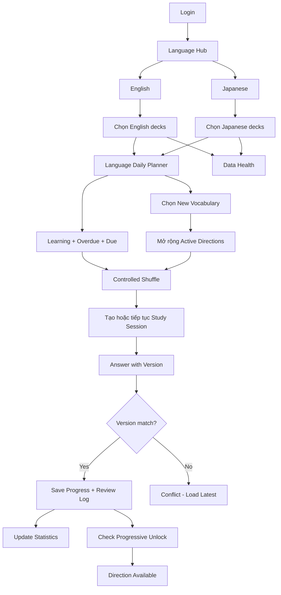

# 17. Master Workflow

```mermaid
flowchart TD
  A[Login] --> B[Language Hub]
  B --> EN[English]
  B --> JA[Japanese]
  EN --> C[Chọn English decks]
  JA --> D[Chọn Japanese decks]
  C --> P[Language Daily Planner]
  D --> P
  P --> E[Learning + Overdue + Due]
  P --> F[Chọn New Vocabulary]
  F --> G[Mở rộng Active Directions]
  E --> H[Controlled Shuffle]
  G --> H
  H --> I[Tạo hoặc tiếp tục Study Session]
  I --> J[Answer with Version]
  J --> K{Version match?}
  K -->|Yes| L[Save Progress + Review Log]
  K -->|No| M[Conflict - Load Latest]
  L --> N[Update Statistics]
  L --> O[Check Progressive Unlock]
  O --> Q[Direction Available]
  C --> R[Data Health]
  D --> R
```
